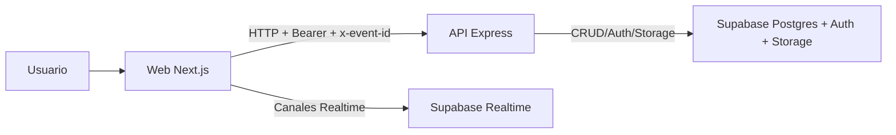

# MUNET

Plataforma integral para la gestión de eventos tipo Modelo de Naciones Unidas (MUN), con comunicación por muros, perfiles, comentarios, encuestas, mensajería directa y control de acceso por evento/comité.

Este repositorio es un **monorepo** con API y frontend web.

- Documentación técnica extensa: [`docs/MUNET_DOCUMENTACION_TECNICA.md`](./docs/MUNET_DOCUMENTACION_TECNICA.md)

## Tabla de contenido

1. [Propósito y alcance](#propósito-y-alcance)
2. [Arquitectura](#arquitectura)
3. [Funcionalidades principales](#funcionalidades-principales)
4. [Estructura del repositorio](#estructura-del-repositorio)
5. [Stack tecnológico](#stack-tecnológico)
6. [Requisitos previos](#requisitos-previos)
7. [Configuración de entorno](#configuración-de-entorno)
8. [Ejecución local](#ejecución-local)
9. [Scripts disponibles](#scripts-disponibles)
10. [Modelo funcional y reglas de negocio](#modelo-funcional-y-reglas-de-negocio)
11. [API (resumen de endpoints)](#api-resumen-de-endpoints)
12. [Realtime](#realtime)

## Propósito y alcance

MUNET centraliza la operación digital de un evento MUN:

- publicaciones en muros (general, avisos, comités),
- perfiles por evento,
- comentarios y encuestas en posts,
- mensajería directa entre participantes,
- trazabilidad con auditoría,
- reglas RBAC por rol y comité.

### Enfoque multi-evento

El sistema está diseñado como multi-tenant por evento:

- cada request de negocio usa `x-event-id`,
- la autorización se resuelve por `event_membership`, no solo por usuario global,
- una misma persona puede tener roles distintos en eventos distintos.

## Arquitectura



### Backend (apps/api)

Arquitectura por capas:

1. `routes/*`: define rutas y middleware.
2. `controllers/*`: maneja HTTP (request/response/errores).
3. `services/*`: lógica de negocio y acceso a datos.
4. `utils/*`: helpers puros de mapeo y reglas comunes.
5. `types/*`: contratos TypeScript.

### Frontend (apps/web)

- Next.js App Router.
- Estado global con Zustand (`auth.store.ts`).
- Cliente API modular (`lib/api/*`).
- Subscripciones realtime con Supabase browser client.

## Funcionalidades principales

- Login por `participant_code + password`.
- Activación de cuenta inicial.
- Selección de evento para admin y reglas de redirección por rol.
- Muros dinámicos por evento/comité (sin hardcode fijo).
- Feed con posts de texto y tipo encuesta.
- Comentarios planos (máximo 1 nivel de respuesta, render plano).
- Voto único por usuario en encuesta con posibilidad de cambiar mientras esté abierta.
- Cierre de encuesta por el autor.
- Soft delete de posts y comentarios (autor o admin según reglas).
- Perfiles:
  - perfil propio,
  - perfil público de terceros,
  - edición administrativa de perfiles de terceros,
  - subida de avatar a Supabase Storage.
- Mensajería directa:
  - reutiliza conversación existente entre dos miembros,
  - crea conversación si no existe.
- Realtime en feed, comentarios, encuestas y chat.

## Estructura del repositorio

```text
munet/
├─ apps/
│  ├─ api/                 # API Express + TS
│  ├─ web/                 # Frontend Next.js
│  └─ docs/                # App docs (template)
├─ docs/
│  └─ MUNET_DOCUMENTACION_TECNICA.md
├─ packages/
│  ├─ eslint-config/
│  ├─ typescript-config/
│  └─ ui/
├─ turbo.json
└─ package.json
```

## Stack tecnológico

- Node.js 18+
- TypeScript
- Express 5 (API)
- Next.js 16 + React 19 (Web)
- Zustand (estado frontend)
- Supabase:
  - Postgres
  - Auth
  - Realtime
  - Storage
- Turborepo (orquestación monorepo)
- Biome / ESLint / TypeScript checker

## Requisitos previos

- Node.js >= 18
- npm (workspaces)
- Proyecto Supabase configurado
- Bucket de Storage para avatares (ej. `profile-images`)

## Configuración de entorno

### 1) API (`apps/api/.env`)

```env
PORT=3002
WEB_APP_URL=http://localhost:3000

SUPABASE_URL=...
SUPABASE_ANON_KEY=...
SUPABASE_SERVICE_ROLE_KEY=...

SUPABASE_PROFILE_IMAGES_BUCKET=profile-images

# Opcional
DM_DELETED_MESSAGE_STATUS=DELETED
```

### 2) Web (`apps/web/.env.local`)

```env
NEXT_PUBLIC_API_URL=http://localhost:3002
NEXT_PUBLIC_SUPABASE_URL=...
NEXT_PUBLIC_SUPABASE_ANON_KEY=...
```

### 3) Base de datos

- Ejecuta tus scripts SQL del esquema actual en Supabase.
- Verifica que tablas críticas existan: `events`, `event_memberships`, `walls`, `posts`, `post_comments`, `polls`, `poll_options`, `poll_votes`, `profiles`, `dm_conversations`, `dm_messages`, `audit_logs`.

## Ejecución local

Desde la raíz del monorepo:

```bash
npm install
npm run dev
```

Esto corre los workspaces con Turbo.

### Ejecutar por app

API:

```bash
cd apps/api
npm run dev
```

Web:

```bash
cd apps/web
npm run dev
```

## Scripts disponibles

Desde la raíz:

- `npm run dev`: desarrollo monorepo.
- `npm run build`: build de workspaces.
- `npm run lint`: lint por workspace.
- `npm run check-types`: verificación de tipos por workspace.
- `npm run format`: formato global (`*.ts`, `*.tsx`, `*.md`).

## Modelo funcional y reglas de negocio

### Autenticación y sesión

- Login sin `event_id` en payload.
- La API devuelve membresías del usuario.
- El frontend decide evento activo según rol/reglas de navegación.

### RBAC

- Admin: acceso transversal en su evento activo.
- Participante/delegado: acceso restringido por comité en muros de comité.
- En avisos, publicación/comentarios según permisos de muro.

### Comentarios

- Profundidad máxima 1 (`parent_comment_id` solo a comentario raíz).
- Las respuestas se agregan al final (lista plana).

### Encuestas

- Mínimo 2 opciones.
- Un voto activo por usuario.
- Voto modificable mientras estado `OPEN`.
- Solo autor puede cerrar encuesta.

### Soft delete

- Se usa `deleted_at` (y metadata relacionada) para preservar trazabilidad.
- El código de lectura debe ignorar registros soft-deleted.

### Perfiles

- Perfil propio editable por su usuario.
- Admin puede editar perfiles de terceros con restricciones de negocio vigentes.
- Avatar subido a Supabase Storage.

## API (resumen de endpoints)

### Auth

- `GET /auth/events-by-code/:participant_code`
- `POST /auth/activate`
- `POST /auth/login`
- `GET /auth/context`

### Eventos

- `GET /events/:eventId/walls`
- `GET /events/:eventId/committees`

### Posts / Comments / Polls

- `GET /posts?muro=<slug>`
- `POST /posts`
- `DELETE /posts/:postId`
- `GET /posts/:postId/comments`
- `POST /posts/:postId/comments`
- `DELETE /posts/:postId/comments/:commentId`
- `POST /posts/:postId/poll/vote`
- `POST /posts/:postId/poll/close`

### Profiles

- `GET /profiles/me`
- `PATCH /profiles/me`
- `POST /profiles/me/avatar`
- `GET /profiles/:membershipId`
- `PATCH /profiles/:membershipId`
- `POST /profiles/:membershipId/avatar`

### DM

- `GET /dm/conversations`
- `POST /dm/conversations`
- `GET /dm/participants`
- `GET /dm/conversations/:conversationId/messages`
- `POST /dm/conversations/:conversationId/messages`
- `DELETE /dm/conversations/:conversationId/messages/:messageId`

## Realtime

MUNET usa Supabase Realtime y en frontend aplica patrón **refetch on change** para mantener consistencia con RBAC y mapeos del backend.

Canales relevantes:

- feed: `posts`, `polls`, `poll_votes`
- comentarios: `post_comments`
- inbox/room DM: `dm_conversations`, `dm_messages`
