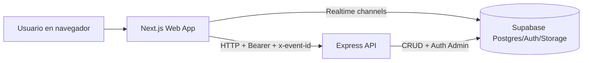

# MUNET - Documentación Técnica Integral (API + Web)

## 1. Contexto y propósito

### 1.1 ¿Qué es MUNET?
MUNET es una plataforma web para operación de eventos tipo Modelo de Naciones Unidas. Su objetivo operativo es centralizar:

- comunicación oficial por muros (general, avisos y comités),
- interacción social entre participantes (posts, comentarios y encuestas),
- perfiles de usuarios por evento,
- mensajería directa (DM) entre miembros de un mismo evento.

El sistema está construido como monorepo con dos aplicaciones principales:

- `apps/api`: backend REST en Express + TypeScript, con persistencia y autenticación sobre Supabase.
- `apps/web`: frontend en Next.js (App Router) + React + Zustand.

### 1.2 Problema que resuelve
Antes de MUNET, la coordinación típica en eventos MUN depende de múltiples canales dispersos (mensajería externa, documentos sueltos, anuncios sin trazabilidad). El sistema resuelve esto con:

- un espacio único y contextual por evento,
- control de acceso por rol y comité (RBAC),
- trazabilidad de acciones críticas (audit logs),
- estado en tiempo real para feed/comentarios/encuestas/chat.

### 1.3 Alcance funcional actual
El código fuente implementa de forma integral:

- activación inicial de cuentas con contraseña temporal,
- login por `participant_code + password` (sin `event_id`),
- contexto multi-evento con selección condicional de evento (admin vs delegado),
- muros dinámicos desde base de datos (sin hardcode),
- feed con posts de texto y encuestas,
- voto único por usuario por encuesta con reemplazo de voto,
- cierre de encuestas por su creador,
- comentarios planos (sin anidamiento profundo),
- soft delete de posts y comentarios con reglas autor/admin,
- perfiles (propio y público), edición admin de terceros, subida de avatar a Supabase Storage,
- mensajería directa con creación/reutilización de conversación,
- sincronización realtime en frontend.

### 1.4 Alcance organizacional
La arquitectura está orientada a “multi-tenant por evento”: casi todas las operaciones de negocio se resuelven con `x-event-id` y la `membership` correspondiente a ese evento.

---

## 2. Arquitectura y diseño

### 2.1 Vista de alto nivel

### 2.2 Estilo arquitectónico backend
La API sigue una arquitectura por capas:

1. `routes/*`: define endpoints y aplica middleware.
2. `controllers/*`: parsing de request, validaciones de borde y mapeo HTTP.
3. `services/*`: reglas de negocio, acceso a datos, RBAC efectivo.
4. `utils/*`: funciones puras de normalización, mapeo y helpers transversales.
5. `types/*`: contratos TS para joins y contexto de autenticación.

Este diseño separa responsabilidades:

- el controller no contiene SQL complejo;
- el service no conoce detalles de Express;
- la lógica reusable se concentra en utilidades testeables.

### 2.3 Estilo arquitectónico frontend
El frontend usa:

- App Router de Next.js para estructura de rutas protegidas,
- Zustand como store central de sesión/contexto (`auth.store.ts`),
- cliente API tipado por dominio (`lib/api/*`),
- componentes de presentación + componentes con lógica de interacción,
- Supabase Browser Client para suscripciones realtime.

La sesión se hidrata desde `localStorage` y el enrutamiento se decide según:

- token válido,
- memberships disponibles,
- rol administrativo,
- `activeEventId` y `activeMembershipId`.

### 2.4 Integración con Supabase
Supabase se usa en 3 frentes:

- **Auth**: login con email/password vía `signInWithPassword`, y validación de token con `auth.getUser`.
- **Postgres**: tablas de negocio (`posts`, `polls`, `post_comments`, `dm_*`, etc.).
- **Storage**: bucket de imágenes de perfil (`profile-images`) para avatares.

El backend usa `SUPABASE_SERVICE_ROLE_KEY` (cliente admin) y el frontend usa cliente anon solo para realtime.

### 2.5 Modelo de identidad y contexto
La identidad efectiva de negocio no es solo `user`, sino `event_membership`.

Campos críticos en el flujo:

- `user` (sistema global),
- `membership` (rol y comité en un evento específico),
- `event_id` activo (`x-event-id`),
- `participant_code` (credencial funcional de acceso).

Esto permite que una persona tenga múltiples participaciones entre eventos con roles distintos.

### 2.6 Seguridad y autorización
La seguridad está repartida en dos niveles:

- **Autenticación**: `requireAuth` valida Bearer token y resuelve usuario + memberships.
- **Autorización**: cada servicio aplica reglas RBAC por evento/muro/comité.

Principios aplicados en código:

- scoping estricto por `event_id`,
- filtros de `deleted_at IS NULL` para entidades soft-deleted,
- validación de pertenencia al evento antes de operar recursos,
- validación autor/admin en operaciones destructivas.

### 2.7 Realtime
Realtime se implementa en frontend con canales de Supabase:

- Feed: `posts`, `polls`, `poll_votes`.
- Comentarios: `post_comments` por `post_id`.
- DM inbox: `dm_conversations`, `dm_messages` por `event_id`.
- DM room: `dm_messages` por `conversation_id` y `dm_conversations` por `id`.

El patrón de sincronización es “refresh on change”: al evento realtime, el frontend vuelve a consultar API para mantener consistencia de reglas y mapeos.

### 2.8 Auditoría y trazabilidad
Se registran acciones relevantes en `audit_logs` con:

- actor (user/membership/role),
- evento,
- entidad y acción,
- outcome (`SUCCESS`/`FAILURE`),
- razón.

Además, intentos de autenticación se guardan en `auth_attempts`.

---

## 3. Estructura del repositorio y propósito de módulos

## 3.1 Monorepo

- `apps/api`: API REST.
- `apps/web`: aplicación cliente.
- `packages/ui`: componentes compartidos base (template turbo, uso limitado real).
- `packages/eslint-config`: configuración ESLint común.
- `packages/typescript-config`: presets TS compartidos.
- `turbo.json`: pipeline de tasks.
- `biome.json`: formatter/linter adicional.

## 3.2 API (`apps/api/src`)

### Núcleo
- `server.ts`: bootstrap Express, CORS, parser JSON, registro de rutas.
- `lib/supabase.ts`: cliente admin y fábrica de cliente auth.
- `lib/cors.ts`: normalización de origen permitido.

### Middleware
- `middleware/auth.middleware.ts`:
  - `requireAuth`: valida token + carga contexto en `req.auth`.
  - `requireEventMembership`: resuelve membership de evento.
  - `requireRole`: guard por roles explícitos.

### Rutas
- `routes/auth.routes.ts`: login, activación, contexto auth.
- `routes/events.routes.ts`: muros y comités del evento.
- `routes/posts.routes.ts`: feed, comentarios, encuestas.
- `routes/profiles.routes.ts`: perfil propio, público, edición y avatar.
- `routes/dm.routes.ts`: conversaciones y mensajes directos.
- `routes/admin.routes.ts`: altas administrativas (evento/comité/membership/cuenta).

### Controllers
- `auth.controller.ts`: activación y login.
- `events.controller.ts`: listing de muros/comités.
- `posts.controller.ts`: orquestación de posts, comentarios y poll actions.
- `profiles.controller.ts`: perfil propio/público y administración de perfiles.
- `dm.controller.ts`: endpoints de chat.
- `admin.controller.ts`: operaciones administrativas de catálogos.

### Services
- `auth-context.service.ts`: resolución de memberships del usuario.
- `walls.service.ts`: carga de muros + flags RBAC (`canAccess`, `canPublish`).
- `posts.service.ts`: núcleo de feed, encuestas y soft delete de posts.
- `comments.service.ts`: comentarios planos y soft delete.
- `dm.service.ts`: conversaciones/mensajes, reuso de conversación y borrado de DM.

### Utilidades
- `utils/rbac.utils.ts`: helpers de rol (`isAdminRole`, reglas announcements).
- `utils/posts.utils.ts`: normalización de rows y mapeo DTO post.
- `utils/walls.utils.ts`: clasificación `general/announcements/committee` y slug.
- `utils/dm.utils.ts`: mapeos de conversación/mensaje para frontend.
- `utils/audit.logger.ts`: logger de auditoría.
- `utils/auth.logger.ts`: logger de intentos de auth.

### Tipos
- `types/auth-context.ts`: shape del contexto auth.
- `types/express.d.ts`: extensión de `Express.Request` con `auth`.
- `types/posts.types.ts`, `types/dm.types.ts`: tipos de joins Supabase.

## 3.3 Web (`apps/web`)

### App Router
- `app/layout.tsx`: layout raíz + `ThemeProvider`.
- `app/page.tsx`: redirect inicial a `/login`.
- `app/(auth)/login/page.tsx`: login + modal de activación.
- `app/select-event/page.tsx`: selector de evento (admin/multi-contexto).
- `app/(main)/layout.tsx`: guard de sesión + shell principal (sidebar/footer).
- `app/(main)/feed/[muro]/page.tsx`: feed completo por muro.
- `app/(main)/profile/page.tsx`: perfil propio.
- `app/(main)/profile/[membershipId]/page.tsx`: perfil público de tercero.
- `app/(main)/chat/page.tsx`: inbox y búsqueda de participantes.
- `app/(main)/chat/[id]/page.tsx`: sala de conversación.

### Componentes de negocio
- `components/layout/Sidebar.tsx`: navegación dinámica por muros/comités.
- `components/feed/PostEditor.tsx`: publicación texto/encuesta.
- `components/feed/PostCard.tsx`: render de post + poll + acciones.
- `components/feed/PostComments.tsx`: comentarios con cooldown anti-doble envío.
- `components/profile/UserHoverCard.tsx`: hover card + acciones de perfil/chat.
- `components/chat/*`: UI de inbox, room, input y mensajes.

### Capa de datos en frontend
- `stores/auth.store.ts`: estado de sesión, memberships y evento activo.
- `lib/api/client.ts`: request wrapper con headers auth/evento.
- `lib/api/*.ts`: clientes por dominio (auth/events/feed/comments/chat/profiles).
- `lib/supabase.ts`: cliente realtime browser.
- `lib/theme-context.tsx`: tema claro/oscuro con persistencia local.

### Tipos frontend
- `types/common.ts`: contratos principales (`Post`, `PostComment`, `PollData`, etc.).
- `types/auth.ts`: sesión y memberships.
- `types/chat.ts`: modelos de inbox/room.

---

## 4. Funcionalidades principales y flujos end-to-end

## 4.1 Activación de cuenta inicial

Endpoint: `POST /auth/activate`

Flujo:

1. Front envía `participant_code`, `event_id`, `initial_password`, `new_password`.
2. API busca `event_memberships` pendiente (`PENDING_ACTIVATION`) y no eliminado.
3. Compara `initial_password` con `initial_password_hash` (bcrypt).
4. Crea usuario en Supabase Auth (`email_confirm: true`).
5. Actualiza tabla `users` con `supabase_auth_user_id`.
6. Marca membership como `ACTIVE`, limpia hash inicial.
7. Registra `auth_attempts`.

Resultado: la cuenta queda operativa para login normal.

## 4.2 Login y contexto de sesión

Endpoint: `POST /auth/login`

Flujo:

1. Se recibe `participant_code + password`.
2. Se buscan memberships activas de ese código (soft-delete excluido).
3. Se resuelve `users.email`.
4. Se autentica con Supabase Auth.
5. Se actualiza `last_login_at` de memberships activas.
6. Se obtiene contexto completo con `getMembershipsByUserId`.
7. API responde `session + user + memberships`.
8. Front persiste token, sesión y memberships en `localStorage`.

## 4.3 Selección de evento y guardas de router

Archivos clave:

- `apps/web/stores/auth.store.ts`
- `apps/web/app/(main)/layout.tsx`
- `apps/web/app/select-event/page.tsx`
- `apps/web/app/(auth)/login/page.tsx`

Regla principal:

- Si el usuario tiene rol admin en alguna membership, pasa por `/select-event`.
- Si no es admin, se autoselecciona su primera membership activa y entra directo a `/feed`.

Esto evita loops entre login/feed/select-event al centralizar la misma regla en store y páginas guard.

## 4.4 Muros y RBAC

Endpoints:

- `GET /events/:eventId/walls`
- `GET /events/:eventId/committees`

Comportamiento:

1. El backend carga muros activos del evento.
2. Clasifica cada muro (`general`, `announcements`, `committee`, `other`).
3. Calcula:
   - `canAccess`: admin o comité correspondiente.
   - `canPublish`: en anuncios solo admin; en otros depende de acceso.
4. Front renderiza todos los muros en sidebar.
5. Si `canAccess = false`, se muestra atenuado/candado; navegación puede existir pero la API responde `403`.

## 4.5 Feed de publicaciones

Endpoint: `GET /posts?muro=<slug>`

Flujo:

1. Front envía token + `x-event-id`.
2. API resuelve muro por slug semántico.
3. Aplica RBAC de acceso al muro.
4. Consulta posts visibles (`status='VISIBLE'`, `deleted_at IS NULL`).
5. Mapea autor + comité + avatar.
6. Si hay polls, enriquece con opciones, conteos, voto propio y permisos (`canVote`, `canClose`).
7. Front aplica filtros locales (texto + comité autor en muro general).

## 4.6 Publicación de texto y encuesta

Endpoint: `POST /posts`

Texto:

- valida contenido no vacío,
- valida permiso `canPublish`,
- inserta post `TEXT`,
- registra auditoría `CREATE_POST`.

Encuesta:

- valida mínimo 2 y máximo 10 opciones,
- crea post tipo `POLL`,
- crea fila en `polls`,
- crea opciones en `poll_options`,
- si falla algo, hace rollback manual de post/poll,
- registra `POLL_CREATED`.

## 4.7 Votar y cambiar voto

Endpoint: `POST /posts/:postId/poll/vote`

Reglas aplicadas:

- post debe ser `POLL`,
- encuesta debe estar `OPEN`,
- opción debe pertenecer a la encuesta,
- usuario mantiene un solo voto activo.

Implementación:

- si ya votó: actualiza voto más reciente y limpia duplicados legacy,
- si no votó: inserta nuevo voto,
- registra `POLL_VOTE`.

## 4.8 Cerrar encuesta

Endpoint: `POST /posts/:postId/poll/close`

Regla de negocio:

- solo el autor de la encuesta puede cerrar.

Efecto:

- `status = CLOSED`, `closed_at`, `closed_by_membership_id`,
- bloqueo de nuevos votos/cambios,
- auditoría `POLL_CLOSED` (éxito o intento inválido).

## 4.9 Comentarios en posts

Endpoints:

- `GET /posts/:postId/comments`
- `POST /posts/:postId/comments`
- `DELETE /posts/:postId/comments/:commentId`

Reglas:

- profundidad máxima 1 (`parent_comment_id` de un comentario raíz),
- respuestas se agregan al final (lista plana cronológica),
- en avisos, comentar sigue misma regla de publicación (solo quienes pueden publicar ahí),
- solo autor o admin puede eliminar comentario.

Soft delete:

- `status='DELETED'`,
- `deleted_by_actor_type = AUTHOR|ADMIN`,
- `deleted_at` y `updated_by_membership_id`.

## 4.10 Soft delete de posts

Endpoint: `DELETE /posts/:postId`

Reglas:

- permitido a autor o admin,
- post eliminado no se lista en feed (`status='VISIBLE'`),
- respuesta de delete devuelve post mapeado para sincronizar UI.

Mensaje funcional asociado (cuando se expone entidad eliminada):

- autor: “Esta publicación fue eliminada por el autor.”
- admin: “Esta publicación fue eliminada por un administrador.”

## 4.11 Perfiles y edición administrativa

Endpoints:

- `GET /profiles/me`, `PATCH /profiles/me`, `POST /profiles/me/avatar`
- `GET /profiles/:membershipId`
- `PATCH /profiles/:membershipId` (admin)
- `POST /profiles/:membershipId/avatar` (admin)

Reglas:

- `role` no editable por endpoint de perfil,
- admin puede editar texto y comité de terceros,
- comité nuevo debe pertenecer al evento activo,
- avatar validado por MIME y tamaño (<= 5MB).

Subida de avatar:

1. Front convierte archivo a base64.
2. API valida tamaño/tipo.
3. Sube a Storage bucket configurado.
4. Persiste `profile_image_path`.
5. Elimina imagen anterior (best-effort).

## 4.12 Mensajes directos (DM)

Endpoints:

- `GET /dm/conversations`
- `POST /dm/conversations`
- `GET /dm/participants`
- `GET /dm/conversations/:conversationId/messages`
- `POST /dm/conversations/:conversationId/messages`
- `DELETE /dm/conversations/:conversationId/messages/:messageId`

Flujo de “Enviar mensaje”:

1. Front solicita `createConversation(targetMembershipId)`.
2. Service busca conversación activa entre A/B en ambos órdenes.
3. Si existe, la reutiliza.
4. Si no existe, la crea.
5. Front navega a `/chat/<conversationId>`.

Reglas:

- prohibido chatear consigo mismo,
- target debe pertenecer al mismo evento y estar activo,
- solo participantes de la conversación pueden leer/escribir,
- solo autor puede eliminar su mensaje.

## 4.13 Realtime operacional

El frontend escucha cambios DB y hace refetch API:

- Feed general/comités/avisos: `posts`, `polls`, `poll_votes`.
- Comentarios de un post: `post_comments` filtrado por `post_id`.
- Inbox DM: `dm_conversations` + `dm_messages`.
- Room DM: `dm_messages` por conversación.

Ventaja: la lógica final siempre pasa por API (no solo por payload realtime), manteniendo consistencia de RBAC y mapeos.

---

## 5. Reglas de negocio y restricciones funcionales

## 5.1 Reglas por rol

- **Admin**:
  - selecciona evento explícitamente,
  - acceso transversal a muros del evento,
  - puede publicar/comentar en avisos,
  - puede borrar posts/comentarios,
  - puede editar perfiles de terceros.

- **Delegado/participante**:
  - entra directo al evento asignado (sin selector),
  - solo accede a muros permitidos por comité,
  - no publica/comenta en avisos si no tiene permiso,
  - no edita perfiles ajenos.

## 5.2 Reglas de scoping

- todo endpoint de negocio usa `x-event-id`,
- la membership debe existir para ese evento,
- cualquier recurso fuera de evento retorna `403/404`.

## 5.3 Reglas de comentarios

- comentario vacío: rechazado,
- respuesta a comentario respuesta: rechazada (profundidad > 1),
- comentario padre de otro post: rechazado.

## 5.4 Reglas de encuestas

- mínimo 2 opciones, máximo 10,
- un voto activo por usuario por encuesta,
- voto modificable mientras esté `OPEN`,
- cierre exclusivo del autor.

## 5.5 Reglas de eliminación lógica

Entidades con soft delete en uso en código:

- `posts`, `post_comments`, `dm_messages`,
- además catálogos: `events`, `committees`, `event_memberships`, `walls`.

Práctica aplicada:

- lectura con `deleted_at IS NULL`,
- en feed, además `status='VISIBLE'`,
- update de metadata de borrado (`deleted_*`, `updated_*`).

## 5.6 Reglas de perfiles

- `first_name` y `last_name` no pueden quedar vacíos,
- `committee_id` debe pertenecer al evento activo,
- MIME permitido avatar: JPG/PNG/WEBP,
- tamaño máximo avatar: 5MB.

---

## 6. Modelo de datos: tablas clave y su papel en el sistema

## 6.1 Identidad y membresías

- `users`: identidad global del sistema.
- `event_memberships`: rol/comité/código por evento.
- `events`: catálogo de eventos.
- `committees`: catálogo de comités por evento.

## 6.2 Muros y contenido social

- `walls`: contenedores de publicación.
- `posts`: publicaciones base (texto y contenedor de encuesta).
- `post_committee_tags`: etiquetas de comité de posts.
- `post_comments`: comentarios de posts.

## 6.3 Encuestas

- `polls`: metadatos de encuesta asociada a `post_id`.
- `poll_options`: opciones por encuesta.
- `poll_votes`: votos por encuesta/opción/membership.

## 6.4 Mensajería directa

- `dm_conversations`: conversación entre dos memberships.
- `dm_messages`: mensajes de una conversación.

## 6.5 Perfil y media

- `profiles`: datos públicos y `profile_image_path`.
- Supabase Storage bucket `profile-images`: binarios de avatar.

## 6.6 Observabilidad

- `audit_logs`: trazabilidad de acciones de negocio.
- `auth_attempts`: historial de login/activación.
- `sessions_audit`: disponible en esquema, uso parcial/no central en flujo actual.

---

## 7. Catálogo de endpoints implementados

## 7.1 Auth

- `GET /auth/events-by-code/:participant_code`
- `POST /auth/activate`
- `POST /auth/login`
- `GET /auth/context` (requiere auth)

## 7.2 Eventos y navegación

- `GET /events/:eventId/walls`
- `GET /events/:eventId/committees`

## 7.3 Posts, comments, polls

- `GET /posts?muro=<slug>`
- `POST /posts`
- `DELETE /posts/:postId`
- `GET /posts/:postId/comments`
- `POST /posts/:postId/comments`
- `DELETE /posts/:postId/comments/:commentId`
- `POST /posts/:postId/poll/vote`
- `POST /posts/:postId/poll/close`

## 7.4 Profiles

- `GET /profiles/me`
- `PATCH /profiles/me`
- `POST /profiles/me/avatar`
- `GET /profiles/:membershipId`
- `PATCH /profiles/:membershipId` (admin)
- `POST /profiles/:membershipId/avatar` (admin)

## 7.5 DM

- `GET /dm/conversations`
- `POST /dm/conversations`
- `GET /dm/participants`
- `GET /dm/conversations/:conversationId/messages`
- `POST /dm/conversations/:conversationId/messages`
- `DELETE /dm/conversations/:conversationId/messages/:messageId`

## 7.6 Admin operativo

- `POST /admin/events`
- `POST /admin/committees`
- `POST /admin/memberships`
- `POST /admin/create-account`

---

## 8. Stack tecnológico y conocimiento requerido

## 8.1 Tecnologías principales

- Runtime: Node.js >= 18.
- Lenguaje: TypeScript.
- Backend: Express 5.
- Frontend: Next.js 16 (App Router), React 19.
- Estado cliente: Zustand.
- DB/Auth/Realtime/Storage: Supabase.
- Estilos: Tailwind CSS 4 + variables CSS.
- Tooling: Turborepo, Biome, ESLint, TypeScript.

## 8.2 Dependencias clave por app

- `apps/api`: `@supabase/supabase-js`, `bcrypt`, `express`, `dotenv`.
- `apps/web`: `next`, `react`, `zustand`, `@supabase/supabase-js`, `tailwindcss`.

## 8.3 Conocimientos necesarios para contribuir

- patrones de arquitectura por capas (controller/service),
- SQL y modelado relacional con soft delete,
- Supabase Auth y RLS (si se mueve lógica al lado DB),
- diseño de RBAC event-scoped,
- App Router de Next.js y render client-side,
- manejo de estado persistente con Zustand,
- diseño de sistemas realtime basados en suscripción + refetch,
- buenas prácticas de auditoría y trazabilidad.

---

## 9. Decisiones de diseño importantes (el por qué)

## 9.1 Login sin `event_id`
Permite una autenticación única y luego resolver contexto por membership. Evita acoplar credenciales a una selección previa de evento.

## 9.2 `x-event-id` en requests de negocio
Hace explícito el tenant activo y simplifica validación de pertenencia. Reduce ambigüedad en usuarios multi-evento.

## 9.3 Realtime con refetch API
En lugar de mutar estado local con payload raw de Realtime, se refetch para mantener mapeo homogéneo y enforcement de reglas en backend.

## 9.4 Soft delete en lugar de hard delete
Preserva trazabilidad y contexto histórico, especialmente útil en entornos institucionales y con auditoría activa.

## 9.5 Reuso de conversación DM
Evita múltiples hilos paralelos entre el mismo par de usuarios y simplifica UX.

---

## 10. Observaciones técnicas para mantenimiento

- Existen cadenas con problemas de encoding en algunos textos (tildes mostradas incorrectamente); conviene normalizar archivos a UTF-8 consistente.
- La API aplica filtros `deleted_at IS NULL` en múltiples servicios; es crítico mantener esta convención en cada endpoint nuevo.
- `packages/ui` contiene componentes base del template turbo que no son el núcleo de la UI actual; no confundir con `apps/web/components`.
- Para cambios de RBAC, revisar siempre en conjunto:
  - `utils/rbac.utils.ts`,
  - `services/walls.service.ts`,
  - servicios de dominio (`posts`, `comments`, `dm`, `profiles`),
  - guards de frontend (`auth.store`, layouts y páginas).

---

## 11. Guía de arranque y comandos útiles

En raíz del monorepo:

- `npm run dev`: levanta apps en modo desarrollo vía Turbo.
- `npm run build`: build de workspaces.
- `npm run check-types`: chequeo de tipos en workspaces.
- `npm run lint`: lint por workspace.

API únicamente:

- `cd apps/api && npm run dev`

Web únicamente:

- `cd apps/web && npm run dev`

---

## 12. Resumen ejecutivo técnico

MUNET implementa una arquitectura moderna y modular para operación de eventos MUN, con separación clara de capas, control de acceso por evento/comité, flujos de autenticación robustos, funcionalidades sociales avanzadas (encuestas, comentarios, mensajes directos), y sincronización en tiempo real.

La base de diseño está fuertemente orientada a:

- consistencia de reglas en backend,
- UX contextual en frontend,
- trazabilidad (auditoría),
- escalabilidad funcional por dominio.

Con esta estructura, nuevos requerimientos (moderación avanzada, métricas, permisos más finos, notificaciones, o hardening RLS) pueden añadirse sin reescritura integral del sistema.

